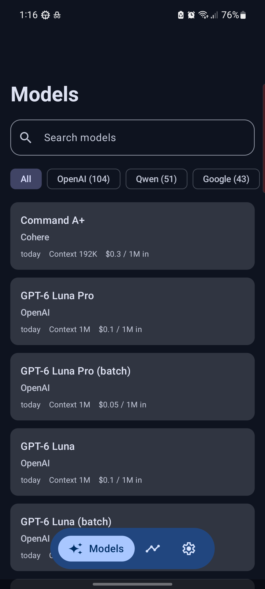
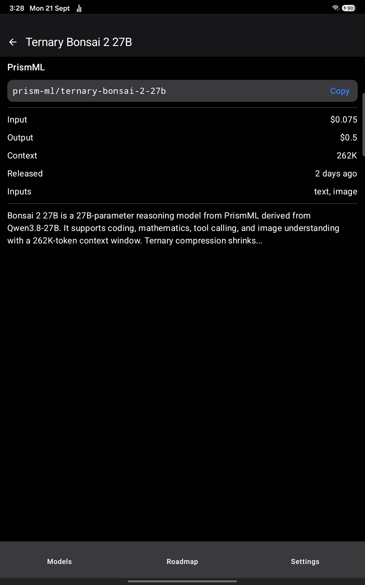
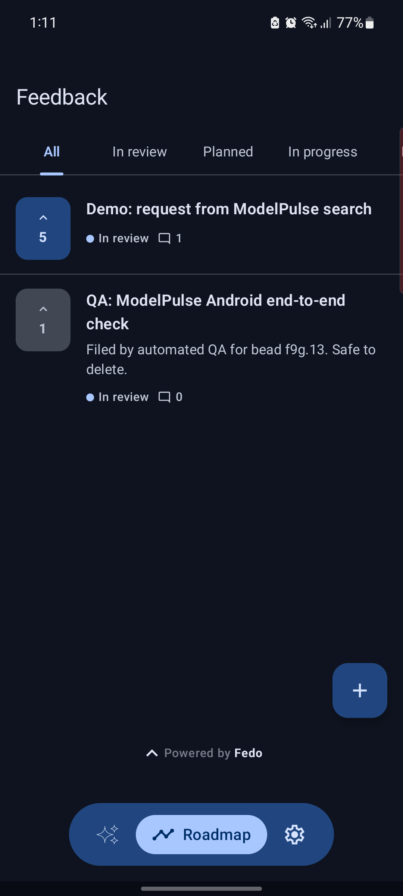
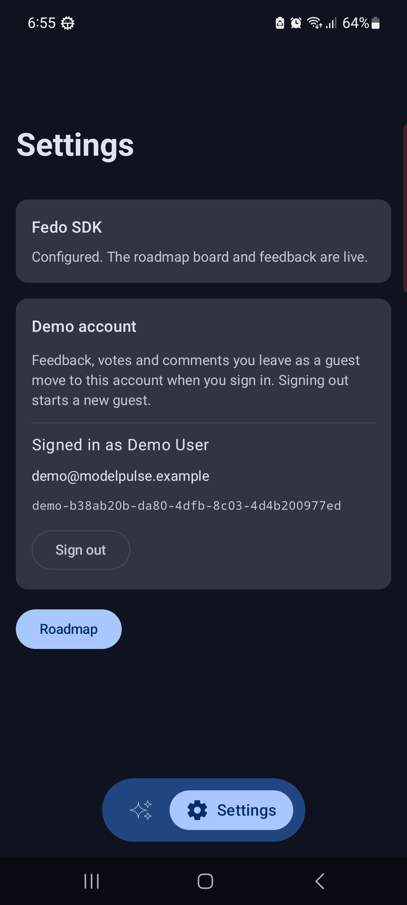
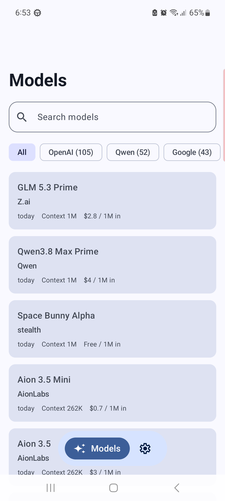
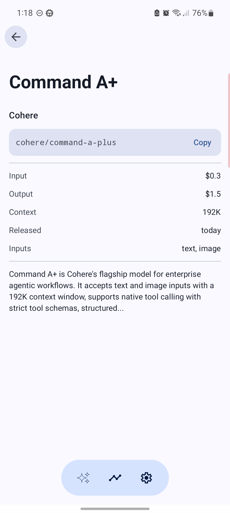
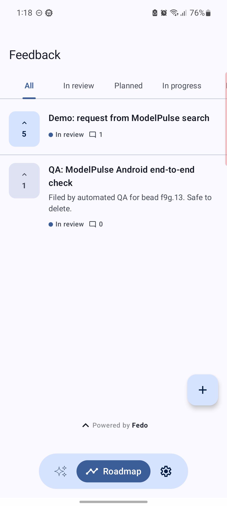
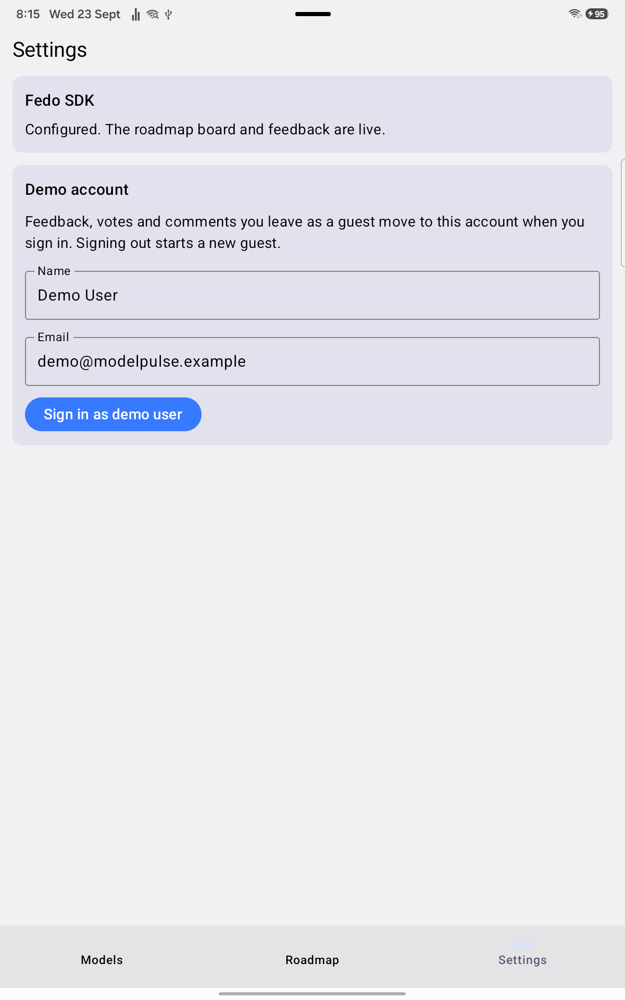

# ModelPulse — Fedo Android SDK example

A small Jetpack Compose app that tracks the newest AI models and shows how to add in-app feedback and feature voting with the [Fedo Android SDK](https://central.sonatype.com/artifact/com.getfedo/sdk-android).

[](https://github.com/getfedo/fedo-android-example/actions/workflows/ci.yml)
[](LICENSE)


## What it shows

ModelPulse lists the newest AI models from the public [OpenRouter](https://openrouter.ai) models API (no key needed) and weaves Fedo into the moments where users naturally have something to say:

- **Models**: newest first, pull to refresh, search by name or id, filter by provider with a count per provider.
- **Model detail**: input and output price per 1M tokens, context window, release date, input modalities, the full description and a copyable model id.
- **Roadmap**: the full Fedo feedback board, where users browse, submit, vote on and comment on requests.
- **Settings**: demo sign-in and sign-out that set the Fedo user identity, plus the Fedo SDK status.

Single `:app` module. Compose, Koin, OkHttp, kotlinx.serialization and Navigation 3; the Fedo SDK is the only non-AndroidX dependency beyond those.

## Screenshots

| Models                                                                                                               | Model detail                                                                                                        | Roadmap                                                                                                  | Settings                                                                                                |
|----------------------------------------------------------------------------------------------------------------------|---------------------------------------------------------------------------------------------------------------------|----------------------------------------------------------------------------------------------------------|---------------------------------------------------------------------------------------------------------|
|  |  |  |  |

<details>
<summary>Light theme</summary>

| Models                                                                                     | Model detail                                                                                 | Roadmap                                                                                            | Settings                                                                             |
|--------------------------------------------------------------------------------------------|----------------------------------------------------------------------------------------------|----------------------------------------------------------------------------------------------------|--------------------------------------------------------------------------------------|
|  |  |  |  |

</details>

Captured on a tablet with a Fedo API key configured. The colours come from the
device wallpaper: the app uses dynamic colour on API 31+ and the Material
baseline schemes below that, so your build will not look identical.

## Requirements

- JDK 21 (the Gradle toolchain resolves 25 for the build itself)
- Android Studio Otter or newer, or just the Gradle wrapper
- `minSdk` 29, `targetSdk` 37
- Kotlin 2.3.21, AGP 9.3.3, Gradle 9.5.0
- [`com.getfedo:sdk-android:0.4.0`](https://central.sonatype.com/artifact/com.getfedo/sdk-android) from Maven Central

Versions are pinned by the SDK's Kotlin floor — see [decisions/0001](specs/decisions/0001-library-versions.md) before bumping anything.

## Quick start

```bash
git clone https://github.com/getfedo/fedo-android-example.git
cd fedo-android-example
cp local.properties.example local.properties   # then add your key
./gradlew :app:installDebug
```

Set `FEDO_API_KEY` in `local.properties` to your key from the [Fedo dashboard](https://app.getfedo.com).

No key yet? The app still builds and runs: the models list, search, filter and detail all work, and the Roadmap and Settings destinations explain how to add one.

## Where Fedo is used

| API                                                                           | File                                                                                             | What it does                                                                                                                                                                                                            |
|-------------------------------------------------------------------------------|--------------------------------------------------------------------------------------------------|-------------------------------------------------------------------------------------------------------------------------------------------------------------------------------------------------------------------------|
| `Fedo.initialize(context, apiKey) { }`                                        | [`ModelPulseApplication.kt`](app/src/main/java/com/fedo/modelpulse/ModelPulseApplication.kt)     | Initializes the SDK once at startup, with debug logging in debug builds. Skipped entirely when no key is configured.                                                                                                    |
| `FedoFeedbackScreen(onDismiss = …)`                                           | [`RoadmapScreen.kt`](app/src/main/java/com/fedo/modelpulse/ui/roadmap/RoadmapScreen.kt)          | The Roadmap destination: the whole feedback board. It owns its internal navigation, so `onDismiss` only fires at the board root and pops the app's own back stack.                                                      |
| `Fedo.setUserID(…)`<br>`Fedo.setUserDisplayName(…)`<br>`Fedo.setUserEmail(…)` | [`SettingsViewModel.kt`](app/src/main/java/com/fedo/modelpulse/ui/settings/SettingsViewModel.kt) | Demo sign-in. Feedback, votes and comments left as a guest move to the signed-in account. The demo id is a generated `demo-` UUID, never the email — a real app passes its own backend user id and keeps PII out of it. |
| `Fedo.setUserProperty("favorite_provider", …)`                                | [`ModelsViewModel.kt`](app/src/main/java/com/fedo/modelpulse/ui/models/ModelsViewModel.kt)       | Records the provider picked in the filter as a user property, so feedback can be segmented by what the user cares about. Properties are user-level and last-write-wins; clearing the filter writes an empty value.      |
| `FedoCreateFeedbackSheet(onDismiss = …)`                                      | [`ModelsScreen.kt`](app/src/main/java/com/fedo/modelpulse/ui/models/ModelsScreen.kt)             | The contextual sheet: "Missing a model? Request it" in the no-results state and "Report a problem" in the load-error state. Both appear only when a key is configured.                                                  |
| `Fedo.logout()`                                                               | [`SettingsViewModel.kt`](app/src/main/java/com/fedo/modelpulse/ui/settings/SettingsViewModel.kt) | Demo sign-out: clears the identity and starts a new guest.                                                                                                                                                              |

How each surface is meant to behave, including without a key, is written down in [specs/fedo-showcase.md](specs/fedo-showcase.md). The full SDK guide is in the [Fedo docs](https://docs.getfedo.com/guide/getting-started/).

## About the API key

Fedo API keys are client-side keys: they are meant to ship inside your app. This project reads `FEDO_API_KEY` from `local.properties` at build time and compiles it into `BuildConfig`, so anyone with the APK can read it.

`local.properties` is gitignored only to keep your key out of git and out of this public repository. Never paste keys into issues, pull requests or logs.

## Running tests

```bash
./gradlew :app:testDebugUnitTest      # unit tests: parsing, formatters, filtering, ViewModels
./gradlew :app:lintDebug              # lint
./gradlew :app:connectedDebugAndroidTest   # Compose UI tests, needs a device
```

The unit tests need no network and no API key: the OpenRouter client is tested against `MockWebServer` with a captured response in `app/src/test/resources/models.json`.

## Project layout

```
app/src/main/java/com/fedo/modelpulse/
  data/          OpenRouter client, AiModel, prices, formatters, filtering
  di/            Koin modules
  ui/models/     models list + search and provider filter
  ui/detail/     model detail
  ui/roadmap/    the Fedo board destination
  ui/settings/   SDK status and demo sign-in
  ui/navigation/ Navigation 3 keys and NavDisplay
specs/           constitution, architecture, Compose and testing patterns, decisions
```

## Contributing

Contributions are welcome. See [CONTRIBUTING.md](CONTRIBUTING.md) for setup and guidelines, and follow the [Code of Conduct](CODE_OF_CONDUCT.md). Report security vulnerabilities privately as described in [SECURITY.md](SECURITY.md). Bugs in the SDK itself belong in [getfedo/fedo-sdk](https://github.com/getfedo/fedo-sdk/issues).

## Credits

Model data by [OpenRouter](https://openrouter.ai). This project is not affiliated with OpenRouter.

## License

This example is available under the [MIT License](LICENSE). The Fedo SDK is distributed under its own license.

## Links

- Fedo: https://getfedo.com
- Documentation: https://docs.getfedo.com/guide/getting-started/
